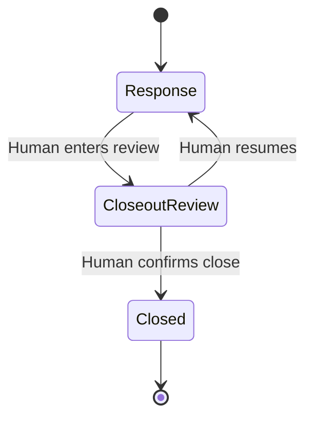

# Drillboard architecture

## One room, two interfaces

The visible command board and WebMCP tools share one persisted exercise state and the pure functions in `src/engine.js`. Agent calls never update a hidden twin: injects, objectives, resources, review queues, forecasts, observations, activity, lifecycle phase, and closeout are rendered from the same state returned to tools.

| Layer | Responsibility |
| --- | --- |
| `src/engine.js` | Pure bounded simulation, scoring, forecast, lifecycle gates, and AAR export |
| `src/app.js` | Persistent state, visible controls, informed approval previews, phase/role tool definitions |
| `src/state.js` | Clone-first transactional commits; storage failure leaves live state unchanged |
| `src/paging.js` | Output budget, item-based JSON pages, and character-cursor Markdown segments |
| `src/webmcp.js` | Per-tool registration diffing, in-flight deferral, embedded-frame guard, schema validation, cancellation, retry, and Tool Lab bridge |
| `index.html` / `styles.css` | Responsive, keyboard-visible, screen-reader-labelled command board |

## Lifecycle state machine



Entering closeout review requires a rationale of at least 20 characters, at least one lesson, and no staged response or communication waiting for review. Active or scheduled injects and incomplete objectives may remain, but their IDs are explicitly preserved in readiness output and the AAR. This permits a time-boxed tabletop to end without pretending all fictional conditions were resolved.

Only the four read-only tools remain in `closeout-review` and `closed`. There is no WebMCP transition tool. Reset starts a new state rather than reopening a closed exercise.

## Role- and state-scoped registration

During response, Coach exposes 9 tools and Facilitator exposes up to 13. The active-inject resolver is omitted when there is no currently resolvable inject. A role, phase, or dynamic-ID change rebuilds tool metadata; `src/webmcp.js` fingerprints each tool's public definition, diffs the set by name, aborts only the tools that disappeared or changed, and registers only the tools that are new or changed. Each registration owns its own `AbortController`.

Registration follows the current top-level API:

```js
await document.modelContext.registerTool(definition, { signal: controller.signal });
```

If native WebMCP is initially unavailable or registration fails, the registry stays in Tool Lab preview mode and retries the same definitions on a later sync. A partial failure aborts the whole attempted set, avoiding a misleading half-registered surface.

Because a tool call typically mutates state and re-renders, a sync is often requested while that tool's native `execute()` promise is still pending. The registry counts in-flight executions and defers the diff until the last one settles (plus one macrotask), so a registration is never aborted underneath a call that is still returning. The registry also refuses to register anything when `window.top !== window.self`, reporting “Embedded frame: native tools disabled” in the status pill.

Every registered `execute(input, { signal })` is wrapped with the same schema validator and output-budget guard used by Tool Lab. This is intentional because current preview browsers may not enforce the declared schema before invoking page code. Aborted executions fail before mutation. Successful native callbacks return one ordinary object; Tool Lab separately renders that object as JSON.

## Narrow, live schemas

All tool inputs are closed objects (`additionalProperties: false`) with bounded strings, numbers, arrays, and enums. Objective, resource, and active-inject IDs are generated from current state. Because full metadata—not only names—is fingerprinted, a changed enum triggers native re-registration.

Tool annotations use the current WebMCP fields: `readOnlyHint` and `untrustedContentHint` (the latter only where output can contain user- or agent-authored text). Results are plain, verifiable objects rather than MCP `content`/`structuredContent` envelopes. A 4,000-character serialized-output guard applies to native and fallback execution. `src/paging.js` provides two bounded-retrieval strategies: `pageItems` pages array-shaped sections by whole item (`offset`/`limit`, `total`, `nextCursor`), shrinking a page below the requested limit rather than splitting an item, so every page is a valid JSON array; `segmentText` slices the Markdown AAR by section and character `cursor`. `read_room` and `list_open_risks` return compact per-item projections (IDs, status, timing, effects, text) and `summary`/`forecast`/`closeout` return one bounded object. Metric values in tool output are rounded to one decimal.

## Simulation and forecast

Clock advancement integrates each inject only across the minutes it was active. Inject deadlines begin at activation, not creation. Objective deadline penalties apply once when crossed. Metric values and proposal effects are bounded to 0–100 and −20–20 respectively.

Forecasting first advances a deterministic copy of the same engine through the requested horizon. Seeded variance is then applied around that shared baseline. This ensures scheduled inject timing and each inject’s actual effect vector influence both the forecast and later clock advancement consistently. The output includes P10, median, and P90 ranges for all five metrics and the overall score, a containment definition, assumptions, generation clock, and a state-fingerprinted run key. A stored forecast is compared with the current board fingerprint everywhere it is exposed; changed forecast-relevant state turns it into a clearly labeled historical result.

## Human-control boundary

WebMCP tools can stage responses, communication drafts, observations, forecasts, and closeout material. Response cards show metric before/after values, objective progress, and live resource availability before a person approves. Resource conflicts disable approval and the engine rechecks availability at decision time.

There is no site tool for approval, publication, lifecycle transition, undo, finalization, or closure. Generic browser automation is outside the site’s WebMCP contract, so documentation describes visible user gates rather than claiming the page can identify who physically clicked a control.

## Hosting and headers

Production runs on ChatGPT Sites, which does not apply custom response headers. WebMCP needs none on a top-level document (the browser default is `Permissions-Policy: tools=self`), so the security posture is carried by the page itself: a `<meta http-equiv="Content-Security-Policy">` in `index.html` (`default-src 'self'`, no inline script or style), the embedded-frame guard in the registry, and same-origin-only fetch handling in the service worker. The `_headers` file is an optional extra for Netlify/Cloudflare Pages deployments and adds `X-Frame-Options: DENY` plus `frame-ancestors 'none'`; it deliberately omits `Cross-Origin-Embedder-Policy`.

## Persistence and offline shell

Version-2 state is stored in `localStorage` under `drillboard.exercise.v2`; the colour theme is a device preference stored separately under `drillboard.theme`, so it survives Reset and scenario switches. Stored state is shape-checked on load (arrays must be arrays, closeout must be an object) and a first render failure falls back to a fresh exercise with a visible “stored exercise was reset” notice. Mutations are applied to a clone and become live only after persistence succeeds, so quota or storage failures roll back cleanly. Reset and scenario switching ask for inline confirmation when the board has changes that no AAR export has captured; the confirmation offers “Export AAR, then reset”. Inject, proposal, communication, decision, observation, forecast, activity, and undo collections are bounded. Terminal closure clears undo history. AAR fields are collapsed to safe inline text and Markdown metacharacters are escaped before export. Service worker cache v4 precaches the shell and all `src/*.js` modules, cleans old caches on activation, and handles only same-origin GET requests. Navigation to the app root and every code asset (`src/*.js`, `styles.css`) is network-first with cache fallback, so a fresh `index.html` is never paired with stale modules; icons and the manifest use stale-while-revalidate. Responses are cloned synchronously before being stored, and only successful (`ok`) same-origin index responses are written to the navigation cache. The undo history is capped at 36 snapshots in memory and truncated to 12 when persisted.
