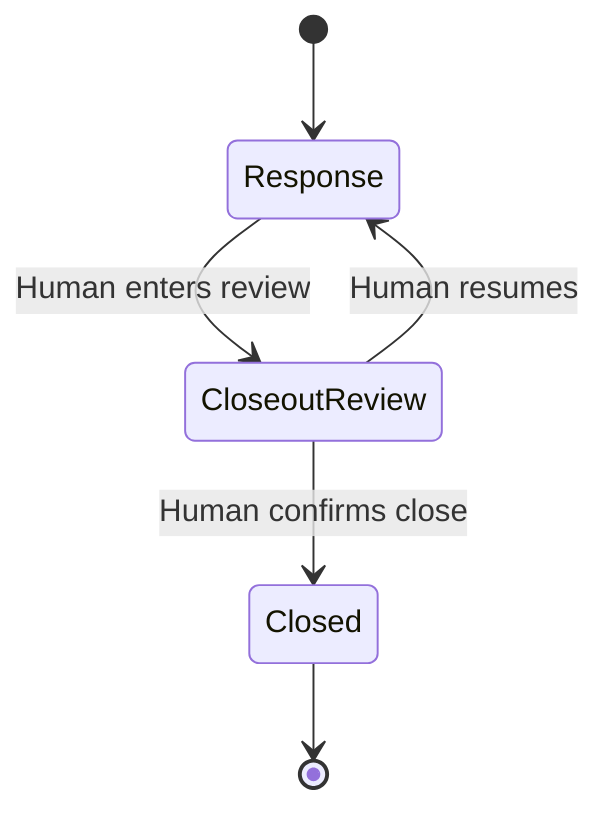

# Drillboard architecture

## One room, two interfaces

The visible command board and WebMCP tools share one persisted exercise state and the pure functions in `src/engine.js`. Agent calls never update a hidden twin: injects, objectives, resources, review queues, forecasts, observations, activity, lifecycle phase, and closeout are rendered from the same state returned to tools.

| Layer | Responsibility |
| --- | --- |
| `src/engine.js` | Pure bounded simulation, scoring, forecast, lifecycle gates, and AAR export |
| `src/app.js` | Persistent state, visible controls, informed approval previews, phase/role tool definitions |
| `src/state.js` | Clone-first transactional commits; storage failure leaves live state unchanged |
| `src/webmcp.js` | Native registration lifecycle, schema validation, cancellation, retry, and Tool Lab bridge |
| `index.html` / `styles.css` | Responsive, keyboard-visible, screen-reader-labelled command board |

## Lifecycle state machine



Entering closeout review requires a rationale of at least 20 characters, at least one lesson, and no staged response or communication waiting for review. Active or scheduled injects and incomplete objectives may remain, but their IDs are explicitly preserved in readiness output and the AAR. This permits a time-boxed tabletop to end without pretending all fictional conditions were resolved.

Only the four read-only tools remain in `closeout-review` and `closed`. There is no WebMCP transition tool. Reset starts a new state rather than reopening a closed exercise.

## Role- and state-scoped registration

During response, Coach exposes 9 tools and Facilitator exposes up to 13. The active-inject resolver is omitted when there is no currently resolvable inject. A role, phase, or dynamic-ID change rebuilds tool metadata; `src/webmcp.js` fingerprints full public definitions, aborts old registrations, and registers replacements serially.

Registration follows the current top-level API:

```js
await document.modelContext.registerTool(definition, { signal: controller.signal });
```

If native WebMCP is initially unavailable or registration fails, the registry stays in Tool Lab preview mode and retries the same definitions on a later sync. A partial failure aborts the whole attempted set, avoiding a misleading half-registered surface.

Every registered `execute(input, { signal })` is wrapped with the same schema validator and output-budget guard used by Tool Lab. This is intentional because current preview browsers may not enforce the declared schema before invoking page code. Aborted executions fail before mutation. Successful native callbacks return one ordinary object; Tool Lab separately renders that object as JSON.

## Narrow, live schemas

All tool inputs are closed objects (`additionalProperties: false`) with bounded strings, numbers, arrays, and enums. Objective, resource, and active-inject IDs are generated from current state. Because full metadata—not only names—is fingerprinted, a changed enum triggers native re-registration.

Tool annotations use the current WebMCP fields: `readOnlyHint` and `untrustedContentHint`. Results are plain, verifiable objects rather than MCP `content`/`structuredContent` envelopes. A 1,500-character serialized-output guard applies to native and fallback execution. `read_room`, open risks, and AAR export expose bounded `section`/`cursor` segments with a `nextCursor`; their complete JSON or Markdown can be reconstructed without one unbounded result.

## Simulation and forecast

Clock advancement integrates each inject only across the minutes it was active. Inject deadlines begin at activation, not creation. Objective deadline penalties apply once when crossed. Metric values and proposal effects are bounded to 0–100 and −20–20 respectively.

Forecasting first advances a deterministic copy of the same engine through the requested horizon. Seeded variance is then applied around that shared baseline. This ensures scheduled inject timing and each inject’s actual effect vector influence both the forecast and later clock advancement consistently. The output includes P10, median, and P90 ranges for all five metrics and the overall score, a containment definition, assumptions, generation clock, and a state-fingerprinted run key. A stored forecast is compared with the current board fingerprint everywhere it is exposed; changed forecast-relevant state turns it into a clearly labeled historical result.

## Human-control boundary

WebMCP tools can stage responses, communication drafts, observations, forecasts, and closeout material. Response cards show metric before/after values, objective progress, and live resource availability before a person approves. Resource conflicts disable approval and the engine rechecks availability at decision time.

There is no site tool for approval, publication, lifecycle transition, undo, finalization, or closure. Generic browser automation is outside the site’s WebMCP contract, so documentation describes visible user gates rather than claiming the page can identify who physically clicked a control.

## Persistence and offline shell

Version-2 state is stored in `localStorage`. Mutations are applied to a clone and become live only after persistence succeeds, so quota or storage failures roll back cleanly. Inject, proposal, communication, decision, observation, forecast, activity, and undo collections are bounded. Terminal closure clears undo history. AAR fields are collapsed to safe inline text and Markdown metacharacters are escaped before export. Service worker cache v3 includes the paging/state modules, uses network-first navigation, cleans old caches on activation, and revalidates same-origin assets so previously visited clients do not remain pinned to challenge-era code.
